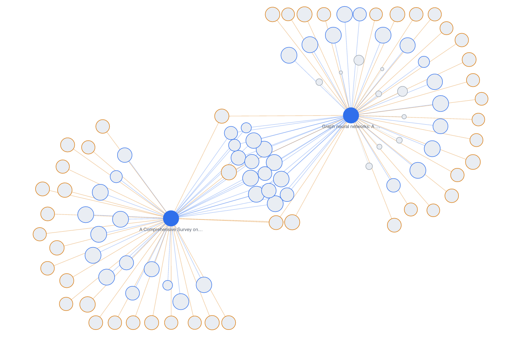
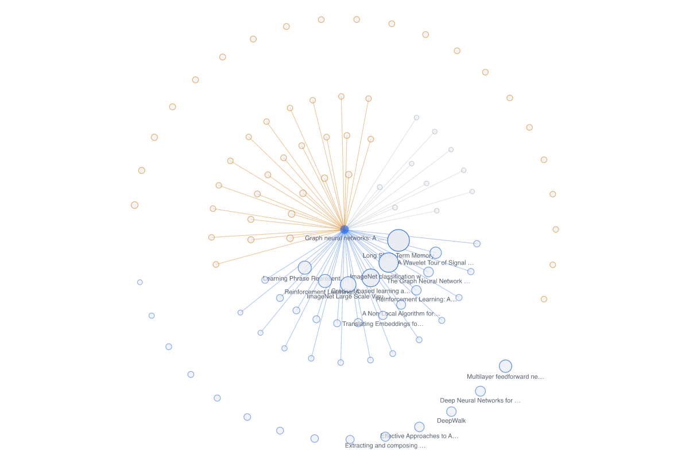

# Research Cat · 文献引用网络工作台

[English](README.en.md) | **中文**

给 **DeepSeek Harness** 加一个文献探索工作台：一个侧栏面板 + 一个 agent 工具，两者**共用同一份内存图**。搜 OpenAlex、把论文收进 collection、展开它的参考文献 / 施引文献 / 相似文献，然后在一张按结构重排的引用网络图上看清它长什么样。

```
搜索 → 加入种子 → 展开（references / citations / related）→ 看图与详情
```

## 预览

| 改进前（力导向布局） | 改进后（径向布局） |
|---|---|
|  |  |

> **这两张图不是面板截图**，而是仓库自带 `lab/render.mjs` 生成的**离线布局渲染**（近似配色，用来评判布局本身）。数据是真实的：两个种子（各 29 篇参考文献 + 10 篇相似 + 25 篇施引文献）共 101 节点 / 118 边。
> 同一份数据在本地实测：总边长 28456 → 11516 px，**交叉数 6 → 0**，hub 处最小夹角 0.0° → 2.9°。

## 安装

### A. 作为可安装插件（推荐）

Research Cat 是一个标准 DSH 插件包：host 半边（`exports["."]`）在宿主进程里注册 `research_cat` 工具与 `/dsh-research-cat` 路由，client 半边（`exports["./client"]`）在 web GUI 里注册侧栏图标与中央面板。**没有构建步骤**——两半边都是普通 JS，client 按宿主契约调用 `window.__ModuleLoader__.load`，React 由 shell 的 `require` 提供。

```bash
dsh plugin --profile <你的 profile> add link:/path/to/dsh-research-cat
```

> ⚠️ **`desktop` profile 由 DSH 桌面应用独占管理**，CLI 会直接拒绝（源码里的 `rejectElectronProfile`）。桌面用户请走应用内的**插件市场**，来源填 `link:/path/to/dsh-research-cat`（dshmarket 支持 `link:` / `file:` 来源）。非桌面 profile 用上面那条命令即可。

### B. 作为动态 Cordis 插件（`dynamic/`）

`dynamic/` 保留了纯动态插件形态的源码（两个 function body）。它**不需要安装**，但只活在进程内存里、**重启即消失**，加载还要过 agent 授权：

```
请读取 dynamic/host.js 与 dynamic/client.js，然后：
1) 调用 cordis_define：plugin.kind = "new"，code.host 用 dynamic/host.js 全文，code.client 用 dynamic/client.js 全文
2) 用返回的 pluginId / packageId 调用 cordis_run，mode = "run"
```

客户端半边会返回 `awaiting-approval`，需要在会话里的 **Run 卡片上点一次授权**（单勾只授权当前版本，**双勾**可授权后续版本）。

**前提**：你的 DSH 会话具备动态 Cordis 插件能力（`cordis_define` / `cordis_run` / `cordis_inspect_self`）。

两种形态装好后都一样：左侧栏出现 **Research Cat** 图标；agent 多出一个 `research_cat` 工具。

## 用法

**A. 让 agent 驱动**（`research_cat` 工具，4 个 action）

| action | 作用 |
|---|---|
| `search` | 按标题 / 作者 / 主题 / DOI 检索，返回 OpenAlex 命中与 work id（如 `W2094864959`） |
| `add` | 把某篇加入 collection（种子） |
| `expand` | 拉某篇的邻居：`references`（它引用的）/ `citations`（引用它的）/ `related`（OpenAlex 认为相似的） |
| `list` | 列出当前 collection |

**B. 在面板里操作**：左侧栏 Research Cat → 搜索框 / 示例词 → 结果列表的 Add → 工具栏 `Auto-expand`、`Re-layout`、`Clear`、三个边类型开关 → 点节点看右侧详情（标题 / 年份 / 被引 / 作者 / 摘要，摘要由 OpenAlex 的倒排索引还原）。

**两者共享同一个内存库**：agent 加进来的论文会出现在面板里，反之亦然。所以最顺手的用法是分工 —— 让 agent 批量检索、建种子、展开邻域，你自己在面板里看图、点节点、读摘要。

## 数据来源与配额

- 数据源：**OpenAlex 公开 API**（`https://api.openalex.org`），**无需 API key**
- 搜索 20 条/页；`references` 与 `related` 每次最多 30 条；`citations` 只取**被引最高的 25 条**（不是全量）
- 图上限 **400 节点**，到顶会拒绝继续展开并提示先 Clear
- `related` 对部分论文为空（OpenAlex 自己就是 0），面板会如实显示，不会编数据

## 重要限制（先读这段）

1. **内存态、不落盘。** 两个半边都没有 `fs` / storage service / `localStorage` 调用，全部状态是 `apply()` 里的 5 个 Map/数组（`nodes` / `links` / `catalog` / `seeds` / `cache`）。进程重启后 collection 与整张图都会清空。
   - 形态 A（可安装插件）**本身是持久的**：装一次之后重启仍在，只是图是空的。
   - 形态 B（动态插件）连插件定义都不持久：重启后要重新加载。
2. **通过 agent 工具发起的检索会进入 DSH 的会话记录**；只在面板里操作则不经过模型、不进会话记录。

## 布局算法

不是力导向调参，而是可解释的径向排布（`src/client.js` 的 `computeLayout`）：

1. **找 hub**：度最大的节点（平手时优先种子、再比被引）→ 放到画布正中心
2. **BFS 分层**：每层占一个半径带
3. **同层按角色分扇区**：`references` / `citations` / `related` 各占一段连续角度，扇区间留 0.2 rad 空隙 —— 一眼能看出哪半边是被引
4. **扇区内按被引数降序**：越重要的越靠内环
5. **环容量公式** `capacity = ⌊arc × r / minSpacing⌋`：同环相邻必定 ≥ minSpacing，装不下就加一环，相邻环**错开半格**
6. **辐条角度分离**：最后把 hub 的各条边拉开到最小 0.05 rad，消除"两条线几乎叠在一起"

节点大小与亮度按被引数归一化；节点描边按角色着色；种子与被引前 18 名常显标签（缩放 ≥1.8 全显）；选中节点时高亮其邻边、淡化无关节点与边。

## 目录结构

```
package.json               插件清单：exports / dsh.bundle.patch / dsh.client
cordis.patch.yml           组合补丁：把本插件的行 insert 进 profile
src/
  index.js                 host 入口（name / inject / apply）
  graph.js                 引擎：OpenAlex 查询 + 内存图 + 8 个操作
  routes.js                /dsh-research-cat JSON 路由（面板用，带 loopback 围栏）
  tools.js                 research_cat agent 工具（defineTool）
  client.js                browser 半边：__ModuleLoader__ 契约 + 侧栏 + 面板
  config.js                配置解析
test/local.mjs             本地验证：加载器契约 / 引擎真实检索 / host 接线（33 项）
dynamic/                   纯动态插件归档（host.js / client.js / plugin.json）
lab/                       离线布局实验台（见下）
preview/                   布局对比渲染图
```

## `lab/` —— 自己改布局并立刻看到效果

```bash
npm i @resvg/resvg-js
node lab/fetch.mjs graph.json W2907492528 W3152893301   # 抓真实数据（两个种子）
node lab/render.mjs graph.json old before               # 旧布局 + 指标
node lab/render.mjs graph.json new after                # 新布局 + 指标
```

- `lab/computeLayout.new.js` 是**与运行实例同源的布局代码**（同一份字面量），改完可以直接贴回 `client.js`
- `lab/render.mjs` 会打印总边长 / 最长边 / hub 最小夹角 / **真实交叉数**，用来客观判断"是不是真的变好了"

## Roadmap

- [ ] 打包成**可安装插件**（TypeScript + tsdown 构建、`dsh.bundle.patch`、独立的 client 产物），让 `npm i` + 加进 profile 的 `dsh.profile.bundles` 即可使用，且**重启不丢**

## License

[MIT](LICENSE)
